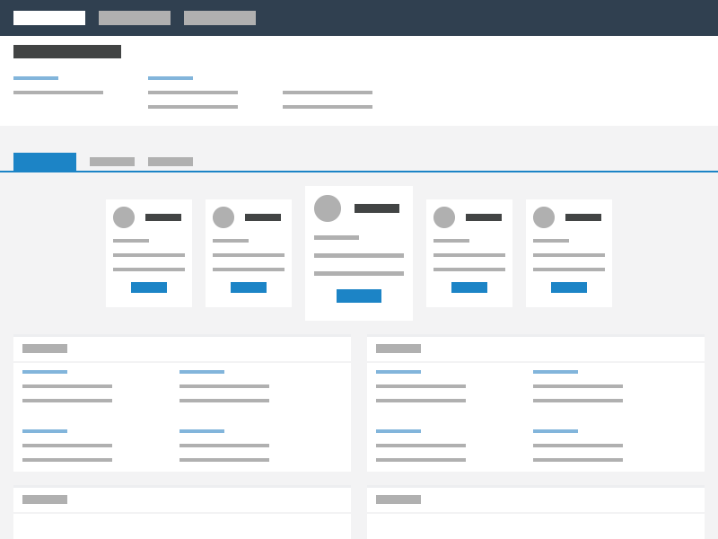
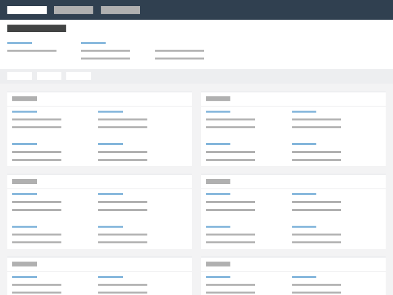

# Page layout

## Grid system
Our layouts are based on the standard [grid system provided in Bootstrap](http://getbootstrap.com/css/#grid) and consist of a responsive, mobile first fluid grid system that appropriately scales up to 12 columns as the device or viewport size increases. Our grid columns have a 15px padding on either side that results in a 30px gutter between columns and a 15px gutter on the grid edges. Even though our columns are fluid, the gutter remains constant. 

Using this grid system allows for a variety of page layouts based on need while still conforming to our design and coding standards. 

## Responsive design
Currently we are using the [column drop pattern](https://developers.google.com/web/fundamentals/design-and-ui/responsive/patterns/column-drop) for our responsive design. This method utilizes a multi-column layout and full-width of the device screen. Column drop simply stacks the columns vertically as the window width becomes too narrow for the content. Eventually this results in all of the columns being stacked vertically. Choosing breakpoints for this layout pattern is dependent on the content and will change for each design.

The overall size of elements in this layout tend to stay consistent. Adapting to various screen sizes instead relies on stacking columns. When and how is each column is stacked at different resolution breakpoints differs for each design, but generally either navigation or content is placed at the top of narrow screens.

## Page layout templates
{{ stache.config.product_name_short }} is meant to be a flexible system and is built to allow for a variety of page layout compositions to best solve workflow needs while still maintaining a consistent feel across your application.

Below is a list of the standard page layouts that can be used when designing with {{ stache.config.product_name_short }}.  These layouts show how components can be packaged together to create a variety of layouts to suit user needs.  While these should cover most needs, the system is flexible enough to accommodate new layouts as needed.

### Work center 
The work center layout is a [tile-based](../../components/tiles) page that is used to surface time sensitive information and allows users to quickly navigate to the timeliest information within the application. It might optionally contain a [page summary](../../components/pagesummary) highlighting the most important information, a [tabbed layout](../../components/tabset) that supports different tasks and a [carousel](../../components/carousel) featuring high-priority items.

### List page
The list page is used when you want to display a large amount of similar data. Lists present multiple line items vertically as a single continuous element. Common controls available include choosing columns, sorting, filtering, searching, and view switching. They may use a tabbed layout to allow the user to switch between different lists, or different pre-filtered instances of the same list.

### Record page
The record page is a tile-based page that consists of a summary section and a main content area. A page summary resides at the top of the page to provide a general overview of a record.  The main content area usually consists of two columns of tiles (or one column for extra small screen sizes like mobile phones) that displays more information about a record in logical sections. The exact content to include in each of these areas will depend on your primary use case.

