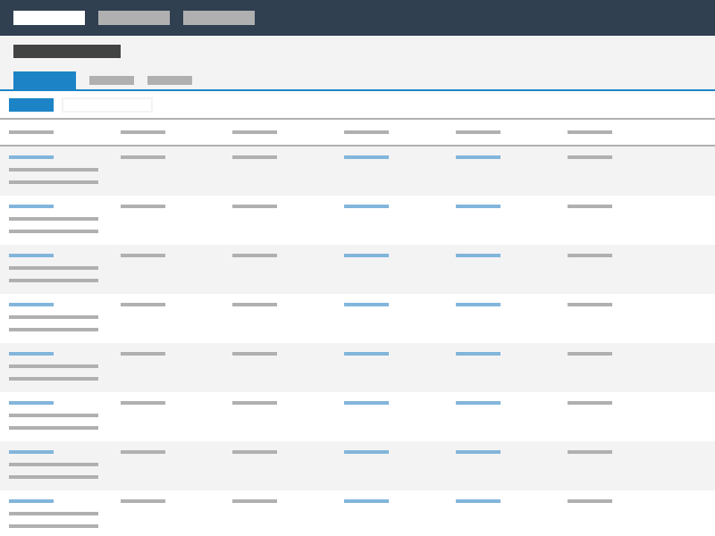

# Page layout

## Grid system
{{ stache.config.product_name_short }} layouts [Bootstrap's responsive, mobile-first, fluid grid system](http://getbootstrap.com/css/#grid) that scales up to 12 columns as the size of devices or viewports increases. Our grid columns have 15px in padding on both sides to create 30px gutters between columns and 15px gutters at the edges of the grid. Our columns are fluid, but these gutters remain constant. 

This grid system allows for a variety of page layouts but still conforms to our design and coding standards. 

## Responsive design
We rely the [column drop pattern](https://developers.google.com/web/fundamentals/design-and-ui/responsive/patterns/column-drop) to create responsive designs. This pattern utilizes a multi-column layout and the full width of the screen. The column drop pattern displays columns horizontally at full width and then stacks columns vertically when the screen width becomes too narrow for the content.

In this multi-column layout, the size of elements tends to remain consistent. Responsive design for various screen sizes relies on stacking columns. When and how to stack columns at different breakpoints varies by design, but navigation or content is generally placed at the top of narrow screens.

## Page layout templates
{{ stache.config.product_name_short }} is a flexible system that allows for a variety of page layouts to solve workflow needs while maintaining a consistent feel across an application.

The following sections describe the standard page layouts for designing with {{ stache.config.product_name_short }}. These layouts show how to package components to create a variety to suit user needs. These layouts should cover most needs, but the system can accommodate new layouts as necessary.

### Work center 
The work center layout provides [a tile-based page](../../components/tiles) that surfaces time-sensitive information and allows users to quickly navigate to the most recent information within an application. It can contain [a page summary](../../components/pagesummary) to highlight the most important information, [a tabbed layout](../../components/tabset) to present different tasks, and [a carousel](../../components/carousel) to feature high-priority items.

### List page
The list page layout provides a page that displays a list of related data. Lists present multiple line items vertically as a single continuous element. Common controls allow users to select the columns to display, sort the list, filter the list, search, and switch views. List pages can use tabs to display multiple lists or display pre-filtered instances of a single list.

### Record page
The record page layout provides a tile-based page that displays a summary section and a main content area. The page summary at the top of the page provides an overview of a record. The main content area usually consists of two columns of tiles (or one column for extra small screens) that displays information about the record in logical sections. The content to include in each area depends on the page's use case.

